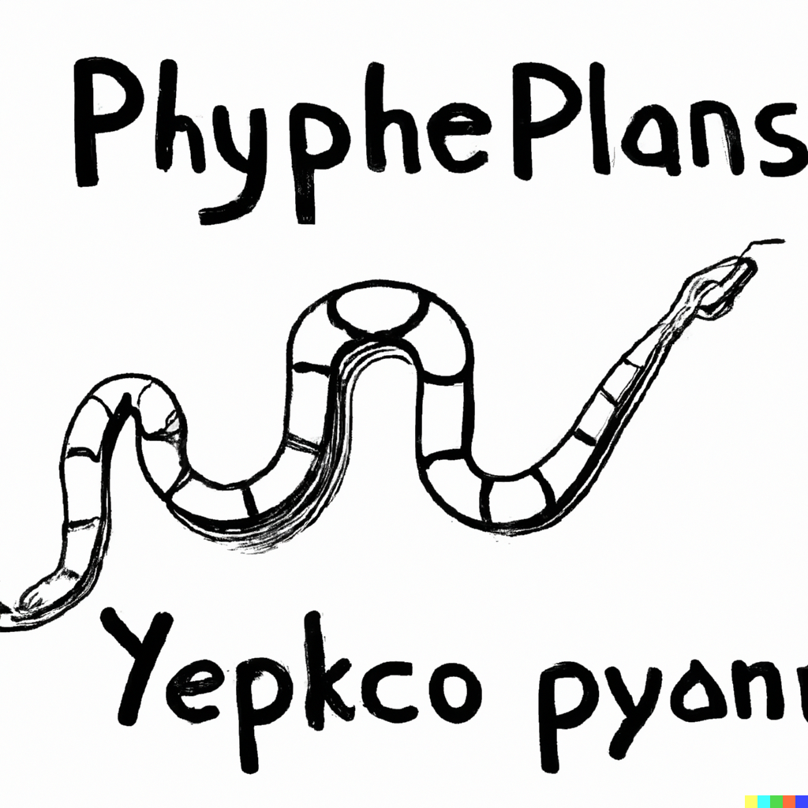

Middle
======
You could put underscore in the middle of Python names.

Python specification
--------------------
No

Convention
__________
Snake case naming convention is using underscore in the middle. Many Python projects are using it.

Example
_______
.. literalinclude:: ../example/middle.py
   :language: Python
