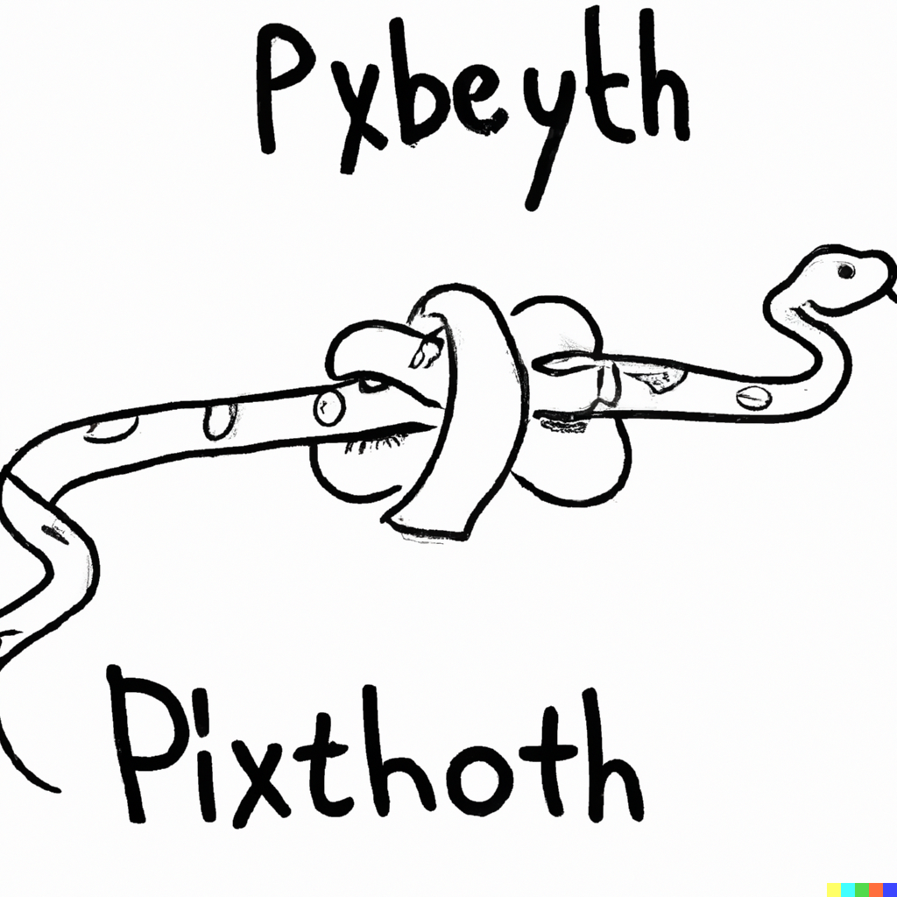

Back
======
Also know as trailing underscore.  This case is focused on a single trailing underscore. Double will be covered later.

Python specification
--------------------
No

Convention
__________

If name of a variable is matching other variable from global scope or Python builtins adding trailing underscore make it looks better.

Example
_______
.. literalinclude:: ../example/back.py
   :language: Python
